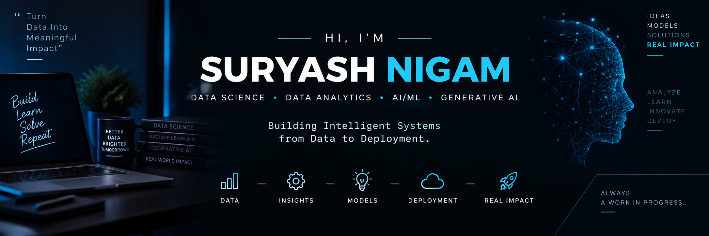

 

<h1>👋 Hi, I'm Suryash Nigam</h1>

  

Building intelligent systems from data to deployment.

---

## 🧠 Who I Am

I'm a Data Science and AI enthusiast focused on building practical,
data-driven applications that solve real-world problems.

I work across:

- 📊 Data Analytics & Visualization
- 🤖 Machine Learning & Deep Learning
- 🧠 Generative AI & LLM Applications
- 🔎 RAG & Vector Search
- 🕸️ Agentic AI & Multi-Agent Systems
- 🗄️ SQL & Business Intelligence

> My goal: turn data and complex problems into reliable,
> useful and deployable solutions.

---

